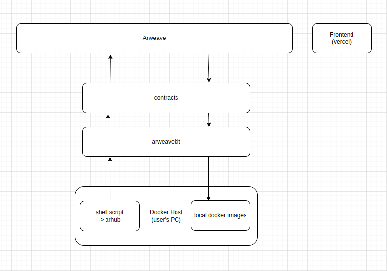

## ArHub - An authentic decentralized docker container registry and hub

### Why a decentralized registry?

Docker is the most important building block in today's software development ecosystem. It facilitates advanced development without worrying about interference from coexisting services and dependencies. Docker containers have made deployments a lot eaiser than it used to be. Therefore, they are the sole players of this ecosystem and the dependency is such that users could be at its mercy. Though I would want to believe docker wouldn't willingly do anything of that sort, but can we really rule out the possibility? Perhaps no. 

I wouldn't be surprised if my container images soon get scrutinised and may even be blocked from public accessibility if a need arises. Guess this is where web3 brings in a sea change amd allows users to take charge of their data. 

While there will always be pessimists and skeptics around, but as software engineers of the current era our sole intent is to innovate. Goes without saying, innovate to solve a problem. So, here I'm presenting you Arhub! Arhub is an authentic decentralized docker container registry and hub.

### Block Diagram



### Usage

##### Pre-requisite
Docker Engine 

##### Push to ArHub
```
arhub$ ./arhub.sh push hello-world:latest

Pushing image:
* img/hello-world:latest.tar
217251462372
{ status: 200, statusText: 'OK', data: {} }
Txn YfJM9d5LPwx2zlcXbvlv9cArq0T9gH9RtFDAL6TiQpQ completed with status [object Object]
uri: https://www.arweave.net/YfJM9d5LPwx2zlcXbvlv9cArq0T9gH9RtFDAL6TiQpQ
arhub$
```

##### Pull from ArHub
```
arhub$ ./arhub.sh pull 3snRI4oG50am_Gnc7N6lil5_esOjbZiXMBLnb5KIMzU

Pulling image:
* 3snRI4oG50am_Gnc7N6lil5_esOjbZiXMBLnb5KIMzU
Image pulled successfully.
Loaded image: hello-world:latest
arhub$

```

### Tech Stack


